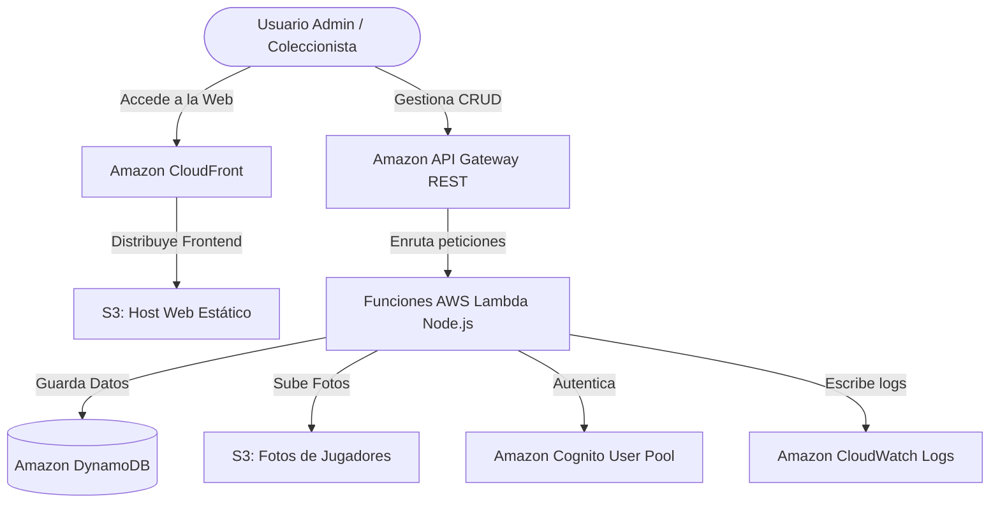

# 🏆 Álbum de Cromos del Mundial - Cloud Serverless Edition

Este proyecto es una aplicación **Serverless** completa de inicio a fin (End-to-End) diseñada para gestionar una colección de cromos del mundial. Cuenta con una arquitectura escalable, moderna y diseñada para funcionar **100% dentro de la capa gratuita (Free Tier)** de AWS.

---

## 📐 Arquitectura del Proyecto

El sistema está dividido en dos partes principales, comunicadas a través de llamadas HTTPS REST:



*   **Frontend**: Desarrollado en **React 18** con **Vite**, estilizado con Vanilla CSS premium y responsivo. Alojado en **Amazon S3** (Static Website Hosting) y distribuido globalmente con **Amazon CloudFront**.
*   **Backend**: Una API REST serverless basada en **AWS Lambda** (Node.js 20) y **Amazon API Gateway**.
*   **Base de Datos**: **Amazon DynamoDB** (configurada en modo Provisioned con 1 RCU / 1 WCU para asegurar $0.00 USD de costo).
*   **Almacenamiento**: **Amazon S3** para alojar fotos de jugadores (mediante subida en Base64 convertida a binario en caliente).
*   **Autenticación**: **Amazon Cognito User Pools** para el registro y login seguro.
*   **Logs y Monitoreo**: **Amazon CloudWatch** con política de retención automática de 7 días para control total de almacenamiento.

---

## 📁 Estructura del Repositorio

*   [cromos-frontend/](file:///c:/Users/Haru/Documents/frontend-cromo-cloud/cromos-frontend): Código fuente de la interfaz web en React.
*   [cromos-backend-cloud-demo/](file:///c:/Users/Haru/Documents/frontend-cromo-cloud/cromos-backend-cloud-demo): Código de las funciones Lambda del backend y plantilla de infraestructura de AWS SAM.

---

## 🚀 Guía de Ejecución Local (Desarrollo)

Ambos componentes cuentan con un modo híbrido que permite desarrollarlos localmente sin necesidad de configurar recursos en AWS de forma inmediata:

### 1. Iniciar el Backend en memoria local
1. Entra a la carpeta de backend:
   ```bash
   cd cromos-backend-cloud-demo
   npm install
   npm run start:local
   ```
   *El backend levantará un servidor Node local en `http://localhost:3001` con persistencia temporal en memoria RAM.*

### 2. Iniciar el Frontend
1. Abre una nueva terminal y entra a la carpeta de frontend:
   ```bash
   cd cromos-frontend
   npm install
   npm run dev
   ```
   *La aplicación web estará disponible en `http://localhost:5173` conectada a tu servidor local.*

---

## ☁️ Guía de Despliegue en AWS (Producción)

### 1. Desplegar el Backend con AWS SAM
El backend se compila y aprovisiona de forma automatizada mediante AWS SAM CLI:

1. Entra a la carpeta del backend:
   ```bash
   cd cromos-backend-cloud-demo
   ```
2. Compila la plantilla de recursos:
   ```bash
   sam build
   ```
3. Ejecuta el despliegue guiado a tu cuenta de AWS:
   ```bash
   sam deploy --guided
   ```
   *Asegúrate de responder **y** (Sí) a la pregunta `Allow SAM CLI IAM role creation` para permitir la creación automática de políticas de seguridad.*

Al finalizar, AWS te dará en los **Outputs** la dirección de tu API (`RestApiUrl`), la cual utilizaremos para conectar el frontend.

### 2. Desplegar el Frontend en Amazon S3
1. Entra a la carpeta del frontend:
   ```bash
   cd cromos-frontend
   ```
2. Abre el archivo `.env` y configura la URL de tu API Gateway en AWS:
   ```env
   VITE_API_URL=https://<tu-api-id>.execute-api.us-east-1.amazonaws.com/dev
   ```
3. Compila los archivos listos para producción:
   ```bash
   npm run build
   ```
4. Sube la carpeta compilada (`dist`) a tu bucket de S3:
   ```bash
   aws s3 sync .\dist s3://<tu-nombre-de-bucket-s3> --delete
   ```

---

## 🔒 Seguridad e Integridad de Datos

Este repositorio tiene configurados archivos `.gitignore` que previenen de forma activa la subida de:
*   Credenciales y variables de entorno locales (`.env`, `.env.local`).
*   Carpetas de dependencias pesadas (`node_modules/`).
*   Directorios temporales de compilación (`dist/`, `.aws-sam/`).

Tus claves privadas de AWS y configuraciones locales están **100% seguras** y no se subirán a tu repositorio de GitHub.
